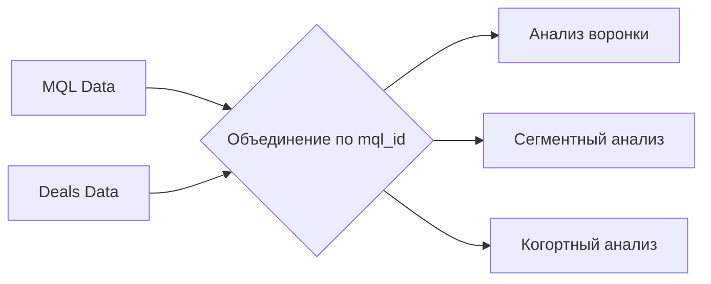

# Комплексный анализ воронки продаж Olist

## 📋 Описание проекта
Данный проект посвящен анализу маркетинговой воронки бразильского маркетплейса **Olist**. Я исследовал путь продавца от момента, когда он впервые оставляет заявку (MQL), до момента заключения сделки и становления продавцом на платформе.

**Почему это важно?**
Понимание воронки продаж позволяет бизнесу:
- Оптимизировать маркетинговый бюджет
- Увеличить конверсию на каждом этапе
- Выявить наиболее перспективные ниши
- Улучшить пользовательский опыт


## 🎯 Цели исследования
1. **Оценить эффективность** текущей воронки продаж
2. **Выявить лучшие каналы** привлечения клиентов
3. **Определить топ-сегменты** бизнеса по количеству сделок
4. **Проанализировать конверсию** по различным источникам трафика
5. **Сформулировать рекомендации** для роста бизнеса

## 📊 Данные
- **Источник данных:** [Kaggle: Marketing Funnel by Olist](https://www.kaggle.com/datasets/olistbr/marketing-funnel-olist/data)
- **Период:** Июнь 2017 - Июнь 2018
- **Маркетинговые лиды (MQL):** 8,000
- **Закрытые сделки:** 842
- **Бизнес-сегментов:** более 50 категорий
  
### Структура данных

```python
# Marketing Qualified Leads (MQL)
mql_columns = {
    'mql_id': 'Уникальный ID лида',
    'first_contact_date': 'Дата первого контакта',
    'landing_page_id': 'ID лендинга',
    'origin': 'Источник трафика'
}

# Closed Deals
deals_columns = {
    'mql_id': 'ID лида (связь с MQL)',
    'seller_id': 'ID продавца',
    'sdr_id': 'ID Sales Development Rep',
    'sr_id': 'ID Sales Representative',
    'won_date': 'Дата закрытия сделки',
    'business_segment': 'Бизнес-сегмент',
    'lead_type': 'Тип лида',
    'lead_behaviour_profile': 'Поведенческий профиль',
    'business_type': 'Тип бизнеса',
    'declared_monthly_revenue': 'Заявленный месячный доход'
}
```

  ## ТЕХНИЧЕСКИЙ СТЕК

| Инструмент | Назначение |
|-----------|-----------|
| **Python 3.10** | Основной язык программирования |
| **Pandas, NumPy** | Обработка и анализ данных |
| **Matplotlib, Seaborn, Seaborn** | Визуализация данных |
| **Google Colab** | Среда разработки |

### Схема данных



## 🔬 Ход исследования

### 1. Загрузка и первичный анализ

```python
import pandas as pd
import numpy as np
import plotly.express as px
import plotly.graph_objects as go

# Загрузка данных
mql_df = pd.read_csv('data/raw/olist_marketing_qualified_leads_dataset.csv')
deals_df = pd.read_csv('data/raw/olist_closed_deals_dataset.csv')

print(f"MQL: {mql_df.shape}")
print(f"Deals: {deals_df.shape}")
```

**Результат:**
- MQL датасет: 8,000 записей, 4 колонки
- Deals датасет: 842 записи, 14 колонок
- Период данных: июнь 2017 — июнь 2018

  ### 2. Очистка данных

```python
# Основные шаги очистки
# 1. Заполнение пропусков в 'origin' → 'unknown'
# 2. Преобразование дат в datetime
# 3. Заполнение категориальных признаков ('business_segment', 'lead_type') → 'unknown'
# 4. Объединение датафреймов по 'mql_id'
# 5. Создание признака 'is_converted'
```
##  Ключевые метрики

### Общая воронка

| Показатель | Значение | Процент |
|----------|----------|---------|
| Маркетинговые лиды (MQL) | 8 000 | 100 % |
| Закрытые сделки | 842 | 10,53 % |
| Потеряно лидов | 7 158 | 89,47 % |

### Конверсия по источникам трафика

| Источник | Лиды | Сделки | Конверсия | Эффективность* |
|--------|------|-------|----------|---------------|
| unknown | 1 159 | 193 | 16,65 % | 1,44 |
| paid_search | 1 586 | 195 | 12,30 % | 2,02 |
| organic_search | 2 296 | 271 | 11,80 % | 0,41 |
| direct_traffic | 499 | 56 | 11,22 % | 7,01 |
| referral | 284 | 24 | 8,45 % | 9,39 |
| social | 1 350 | 75 | 5,56 % | 1,46 |
| display | 118 | 6 | 5,08 % | 7,26 |
| other_publicities | 65 | 3 | 4,62 % | 7,70 |
| email | 493 | 15 | 3,04 % | 3,04 |
| other | 150 | 4 | 2,67 % | 3,34 |

> *Эффективность = конверсия / доля трафика (чем выше, тем лучше)

---

##  Визуализации

### 1. Воронка продаж
<div align="center">
  
  <p><em>Рисунок 1. Воронка продаж Olist</em></p>
</div>

**Наблюдение:** только каждый 10‑й лид становится продавцом. Основные потери происходят на этапе между первым контактом и закрытием сделки.

### 2. Распределение лидов по источникам

<div align="center">
  
  <p><em>Рисунок 2. Распределение маркетинговых лидов по источникам трафика</em></p>
</div>

**Ключевые каналы:**
* 🥇 `organic_search` — 28,7 % (2 296 лидов);
* 🥈 `paid_search` — 19,8 % (1 586 лидов);
* 🥉 `social` — 16,9 % (1 350 лидов).

### 3. Конверсия по источникам

<div align="center">
  
  <p><em>Рисунок 3. Конверсия MQL → Closed Deal по источникам трафика</em></p>
</div>

**Топ‑3 по конверсии:**
* `unknown` — 16,65 % (требует уточнения);
* `paid_search` — 12,30 % (самый эффективный);
* `organic_search` — 11,80 % (стабильный результат).

### 4. Топ‑10 бизнес‑сегментов

<div align="center">
  
  <p><em>Рисунок 4. Топ-10 бизнес-сегментов по количеству закрытых сделок</em></p>
</div>

| Место | Сегмент | Сделок | Доля |
|------|--------|-------|------|
| 🥇 | home_decor | 105 | 17,6 % |
| 🥈 | health_beauty | 93 | 15,6 % |
| 🥉 | car_accessories | 77 | 12,9 % |
| 4 | household_utilities | 71 | 11,9 % |
| 5 | construction_tools_house_garden | 69 | 11,6 % |
| 6 | audio_video_electronics | 64 | 10,7 % |
| 7 | computers | 34 | 5,7 % |
| 8 | pet | 30 | 5,0 % |
| 9 | food_supplement | 28 | 4,7 % |
| 10 | food_drink | 26 | 4,4 % |

### 5. User Journey Map

<div align="center">
  
  <p><em>Рисунок 5. Карта пути пользователя (User Journey Map)</em></p>
</div>

| Этап | Действие | Эмоция | Метрика |
|------|----------|--------|---------|
| Осознание | Переход на лендинг | 🤔 Заинтересованность | 8 000 лидов |
| Рассмотрение | Контакт с SDR | 😊 Оптимизм | ~3 500 консультаций |
| Решение | Консультация с SR | 😰 Сомнение | ~1 500 решений |
| Действие | Регистрация | 😫 Стресс | 842 сделки |
| Лояльность | Первые продажи | 😌 Доверие | 600+ активных |

---

## 🔍 Выводы и анализ

### Основные инсайты


📌 **Инсайт #1: Правило Парето в действии**

```python
top_3_segments = ['home_decor', 'health_beauty', 'car_accessories']
top_3_deals = 105 + 93 + 77  # 275 сделок
total_deals = 597  # сделки в топ-10
share = (275 / 597) * 100  # 46.1%

print(f"Топ-3 сегмента дают {share:.1f}% всех сделок")
# Вывод: 46.1% сделок приходится на 30% сегментов


