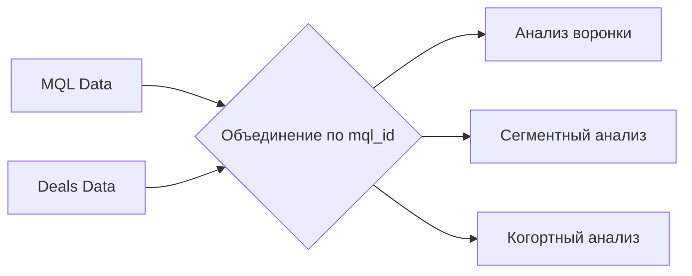

# Комплексный анализ воронки продаж Olist

## 📋 Описание проекта
Данный проект посвящен анализу маркетинговой воронки бразильского маркетплейса **Olist**. Я исследовал путь продавца от момента, когда он впервые оставляет заявку (MQL), до момента заключения сделки и становления продавцом на платформе.

**Почему это важно?**
Понимание воронки продаж позволяет бизнесу:
- Оптимизировать маркетинговый бюджет
- Увеличить конверсию на каждом этапе
- Выявить наиболее перспективные ниши
- Улучшить пользовательский опыт


## 🎯 Цели исследования
1. **Оценить эффективность** текущей воронки продаж
2. **Выявить лучшие каналы** привлечения клиентов
3. **Определить топ-сегменты** бизнеса по количеству сделок
4. **Проанализировать конверсию** по различным источникам трафика
5. **Сформулировать рекомендации** для роста бизнеса

## 📊 Данные
- **Источник данных:** [Kaggle: Marketing Funnel by Olist](https://www.kaggle.com/datasets/olistbr/marketing-funnel-olist/data)
- **Период:** Июнь 2017 - Июнь 2018
- **Маркетинговые лиды (MQL):** 8,000
- **Закрытые сделки:** 842
- **Бизнес-сегментов:** более 50 категорий
- **Основные поля:**
- `mql_id` — уникальный ID лида
- `first_contact_date` — дата первого контакта
- `origin` — источник трафика
- `business_segment` — бизнес-сегмент
- `won_date` — дата закрытия сделки


  ## ТЕХНИЧЕСКИЙ СТЕК

| Инструмент | Назначение |
|-----------|-----------|
| **Python 3.10** | Основной язык программирования |
| **Pandas, NumPy** | Обработка и анализ данных |
| **Matplotlib, Seaborn, Seaborn** | Визуализация данных |
| **Google Colab** | Среда разработки |

### Схема данных



## 🔬 Ход исследования

### 1. Загрузка и первичный анализ

```python
import pandas as pd
import numpy as np
import plotly.express as px
import plotly.graph_objects as go

# Загрузка данных
mql_df = pd.read_csv('data/raw/olist_marketing_qualified_leads_dataset.csv')
deals_df = pd.read_csv('data/raw/olist_closed_deals_dataset.csv')

print(f"MQL: {mql_df.shape}")
print(f"Deals: {deals_df.shape}")
```

**Результат:**
- MQL датасет: 8,000 записей, 4 колонки
- Deals датасет: 842 записи, 14 колонок
- Период данных: июнь 2017 — июнь 2018


