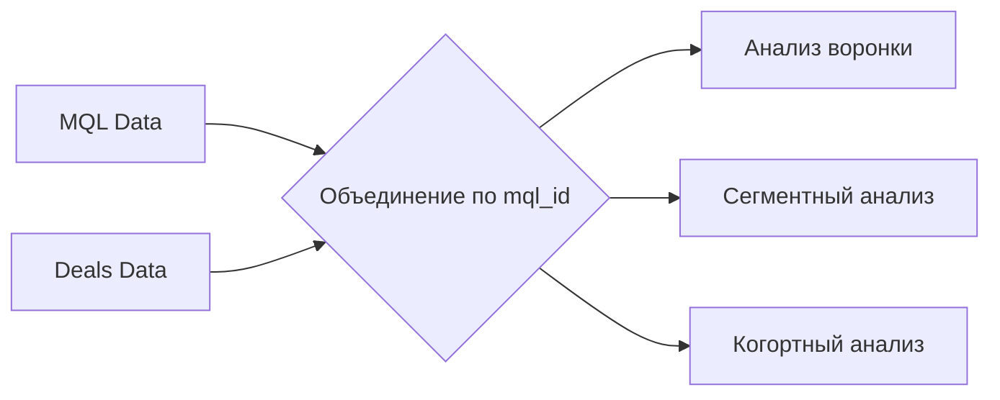

# Проект 3. Комплексный анализ воронки продаж Olist

##  Описание проекта
Данный проект посвящен анализу маркетинговой воронки бразильского маркетплейса **Olist**. Я исследовала путь продавца от момента, когда он впервые оставляет заявку (MQL), до момента заключения сделки и становления продавцом на платформе.

**Почему это важно?**
Понимание воронки продаж позволяет бизнесу:
- Оптимизировать маркетинговый бюджет
- Увеличить конверсию на каждом этапе
- Выявить наиболее перспективные ниши
- Улучшить пользовательский опыт


## Цели исследования
1. **Оценить эффективность** текущей воронки продаж
2. **Выявить лучшие каналы** привлечения клиентов
3. **Определить топ-сегменты** бизнеса по количеству сделок
4. **Проанализировать конверсию** по различным источникам трафика
5. **Сформулировать рекомендации** для роста бизнеса

## Данные
- **Источник данных:** [Kaggle: Marketing Funnel by Olist](https://www.kaggle.com/datasets/olistbr/marketing-funnel-olist/data)
- **Период:** Июнь 2017 - Июнь 2018
- **Маркетинговые лиды (MQL):** 8,000
- **Закрытые сделки:** 842
- **Бизнес-сегментов:** более 50 категорий
  
### Структура данных

```python
# Marketing Qualified Leads (MQL)
mql_columns = {
    'mql_id': 'Уникальный ID лида',
    'first_contact_date': 'Дата первого контакта',
    'landing_page_id': 'ID лендинга',
    'origin': 'Источник трафика'
}

# Closed Deals
deals_columns = {
    'mql_id': 'ID лида (связь с MQL)',
    'seller_id': 'ID продавца',
    'sdr_id': 'ID менеджера по развитию продаж (SDR)',
    'sr_id': 'ID менеджера по продажам (SR)',
    'won_date': 'Дата закрытия сделки',
    'business_segment': 'Бизнес-сегмент',
    'lead_type': 'Тип лида',
    'lead_behaviour_profile': 'Поведенческий профиль',
    'business_type': 'Тип бизнеса',
    'declared_monthly_revenue': 'Заявленный месячный доход'
}
```

  ## ТЕХНИЧЕСКИЙ СТЕК

| Инструмент | Назначение |
|-----------|-----------|
| **Python 3.10** | Основной язык программирования |
| **Pandas, NumPy** | Обработка и анализ данных |
| **Matplotlib, Seaborn, Plotly** | Визуализация данных |
| **Google Colab** | Среда разработки |

### Схема данных


```mermaid
graph LR
    A[MQL Data] --> C{Объединение по mql_id}
    B[Deals Data] --> C
    C --> D[Анализ воронки]
    C --> E[Сегментный анализ]
    C --> F[Когортный анализ]
```

##  Ход исследования

### 1. Загрузка и первичный анализ

```python
import pandas as pd
import numpy as np
import plotly.express as px
import plotly.graph_objects as go

# Загрузка данных
mql_df = pd.read_csv('data/raw/olist_marketing_qualified_leads_dataset.csv')
deals_df = pd.read_csv('data/raw/olist_closed_deals_dataset.csv')

print(f"MQL: {mql_df.shape}")
print(f"Deals: {deals_df.shape}")
```

**Результат:**
- MQL датасет: 8,000 записей, 4 колонки
- Deals датасет: 842 записи, 14 колонок
- Период данных: июнь 2017 — июнь 2018

  ### 2. Очистка данных

**Основные шаги очистки:**
1. Заполнение пропусков в 'origin' → 'unknown'
2. Преобразование дат в datetime
3. Заполнение категориальных признаков ('business_segment', 'lead_type') → 'unknown'
4. Объединение датафреймов по 'mql_id'
5. Создание признака 'is_converted'

##  Ключевые метрики

### Общая воронка

| Показатель | Значение | Процент |
|----------|----------|---------|
| Маркетинговые лиды (MQL) | 8 000 | 100 % |
| Закрытые сделки | 842 | 10,53 % |
| Потеряно лидов | 7 158 | 89,47 % |

### Конверсия по источникам трафика

| Источник | Лиды | Сделки | Конверсия | Эффективность* |
|--------|------|-------|----------|---------------|
| unknown | 1 159 | 193 | 16,65 % | 1,44 |
| paid_search | 1 586 | 195 | 12,30 % | 2,02 |
| organic_search | 2 296 | 271 | 11,80 % | 0,41 |
| direct_traffic | 499 | 56 | 11,22 % | 7,01 |
| referral | 284 | 24 | 8,45 % | 9,39 |
| social | 1 350 | 75 | 5,56 % | 1,46 |
| display | 118 | 6 | 5,08 % | 7,26 |
| other_publicities | 65 | 3 | 4,62 % | 7,70 |
| email | 493 | 15 | 3,04 % | 3,04 |
| other | 150 | 4 | 2,67 % | 3,34 |

> *Эффективность = конверсия / доля трафика (чем выше, тем лучше)

---

##  Визуализации

### 1. Воронка продаж
<div align="center">
  
  <p><em>Рисунок 1. Воронка продаж Olist</em></p>
</div>

**Наблюдение:** только каждый 10‑й лид становится продавцом. Основные потери происходят на этапе между первым контактом и закрытием сделки.

### 2. Распределение лидов по источникам

<div align="center">
  
  <p><em>Рисунок 2. Распределение маркетинговых лидов по источникам трафика</em></p>
</div>

**Ключевые каналы:**
* 1 `organic_search` — 28,7 % (2 296 лидов);
* 2 `paid_search` — 19,8 % (1 586 лидов);
* 3 `social` — 16,9 % (1 350 лидов).

### 3. Конверсия по источникам

<div align="center">
  
  <p><em>Рисунок 3. Конверсия MQL → Closed Deal по источникам трафика</em></p>
</div>

**Топ‑3 по конверсии:**
* `unknown` — 16,65 % (требует уточнения);
* `paid_search` — 12,30 % (самый эффективный);
* `organic_search` — 11,80 % (стабильный результат).

### 4. Топ‑10 бизнес‑сегментов

<div align="center">
  
  <p><em>Рисунок 4. Топ-10 бизнес-сегментов по количеству закрытых сделок</em></p>
</div>

| Место | Сегмент | Сделок | Доля |
|------|--------|-------|------|
| 1 | home_decor | 105 | 17,6 % |
| 2 | health_beauty | 93 | 15,6 % |
| 3 | car_accessories | 77 | 12,9 % |
| 4 | household_utilities | 71 | 11,9 % |
| 5 | construction_tools_house_garden | 69 | 11,6 % |
| 6 | audio_video_electronics | 64 | 10,7 % |
| 7 | computers | 34 | 5,7 % |
| 8 | pet | 30 | 5,0 % |
| 9 | food_supplement | 28 | 4,7 % |
| 10 | food_drink | 26 | 4,4 % |

### Когортный анализ
Когортный анализ позволяет отследить, как меняется конверсия лидов в зависимости от месяца их первого контакта с платформой. Cгруппируем лидов по месяцу первого обращения и посмотрим, сколько из них становятся продавцами и как быстро.

### Динамика конверсии по месяцам

<div align="center">
  
  <p><em>Рисунок 5. Динамика конверсии по месяцам первого контакта</em></p>
</div>

### Когортная таблица

| Когорта | Лиды | Месяц 0 | Месяц 1 | Месяц 2 | Месяц 3+ | Всего сделок | Конверсия % |
|---------|------|---------|---------|---------|----------|--------------|-------------|
| 2017-06 | 4 | 0 | 0 | 0 | 0 | 0 | 0.00% |
| 2017-07 | 239 | 0 | 0 | 0 | 2 | 2 | 0.84% |
| 2017-08 | 386 | 0 | 0 | 0 | 9 | 9 | 2.33% |
| 2017-09 | 312 | 0 | 0 | 0 | 7 | 7 | 2.24% |
| 2017-10 | 416 | 0 | 0 | 0 | 14 | 14 | 3.37% |
| 2017-11 | 445 | 0 | 2 | 4 | 12 | 18 | 4.04% |
| 2017-12 | 200 | 1 | 3 | 2 | 5 | 11 | 5.50% |
| **2018-01** | **1,141** | **64** | **43** | **16** | **29** | **152** | **13.32%** |
| **2018-02** | **1,028** | **65** | **48** | **11** | **25** | **149** | **14.49%** |
| **2018-03** | **1,174** | **82** | **47** | **11** | **27** | **167** | **14.22%** |
| **2018-04** | **1,352** | **129** | **25** | **13** | **16** | **183** | **13.54%** |
| 2018-05 | 1,303 | 70 | 28 | 7 | 25 | 130 | 9.98% |

###  Тепловая карта когорт

<div align="center">
  
  <p><em>Рисунок 6. Тепловая карта: распределение сделок по месяцам после первого контакта</em></p>
</div>

*Тепловая карта показывает, сколько сделок закрылось в каждый месяц после первого контакта. Чем ярче цвет, тем больше сделок.*

---

## Выводы и анализ

### Основные инсайты


 **1: Правило Парето в действии**

```python
top_3_segments = ['home_decor', 'health_beauty', 'car_accessories']
top_3_deals = 105 + 93 + 77  # 275 сделок
total_deals = 597  # сделки в топ-10
share = (275 / 597) * 100  # 46.1%

print(f"Топ-3 сегмента дают {share:.1f}% всех сделок")
```
**Вывод:** Анализ подтвердил действие правила Парето: фокусировка на 30% ключевых сегментов (home_decor, health_beauty, car_accessories) обеспечивает 46.1% всех закрытых сделок. Это позволяет оптимизировать маркетинговый бюджет и усилия sales-команды."

**2: Парадокс платного трафика**

```text
organic_search: 28,7 % трафика → конверсия 11,8 %
paid_search: 19,8 % трафика → конверсия 12,3 %
```
**Вывод:** Платный трафик качественнее и требует увеличения бюджета

**3: Кризис email-маркетинга**

```python
email_conversion = 3.04  # %
avg_conversion = 10.53  # %
gap = avg_conversion - email_conversion  # 7.49%
print(f"Email-маркетинг отстает от среднего на {gap:.1f}%")
```
**Вывод:** Email-маркетинг отстает от средней конверсии на **7.5%**. Необходимо пересмотреть стратегию.

**4: Реферальный потенциал**
```text
Данные
- referral_traffic: 3.5% от общего объема
- referral_conversion: 8.45% (выше среднего уровня)
```
**Выводы**: Высокая эффективность рефералов указывает на значительный потенциал программы лояльности.

 **5: Абсолютный лидер**
```text
Данные
- home_decor: 105 сделок (17.6% от топ-10 категорий)
```
**Выводы**: Домашний декор является абсолютным лидером продаж и требует разработки специальной премиальной стратегии продвижения.

### Ключевые инсайты когортного анализа:

**6: Резкий рост качества лидов в 2018 году**
```text
- 2017 год: средняя конверсия 2.6%
- 2018 год: средняя конверсия 13.1%

Качество лидов выросло в 5 раз! 
```
**7: Скорость закрытия сделок**

```python
# Суммируем сделки 2018 года по месяцам после контакта
month_0 = 64 + 65 + 82 + 129 + 70 = 410
month_1 = 43 + 48 + 47 + 25 + 28 = 191
month_2 = 16 + 11 + 11 + 13 + 7 = 58
month_3plus = 29 + 25 + 27 + 16 + 25 = 122

quick_deals = month_0 + month_1  # 410 + 191 = 601
quick_share = (quick_deals / 781) * 100  # 76.9%

print(f"76.9% сделок закрываются в первые 2 месяца!")
```
**8: Пик и спад**
```text
Пик конверсии: февраль 2018 (14.49%)
Самый низкий результат: декабрь 2017 (5.50%)

Праздничный сезон негативно влияет на качество лидов
```
**9: Масштабирование без потери качества**
```text
Рост лидов: 2002 (2017) → 5998 (2018) = +200%
Рост сделок: 61 (2017) → 781 (2018) = +1180%
Рост конверсии: 2.6% → 13.1% = +404%
```
> **Когортный анализ показал впечатляющие результаты:**
>
> - Конверсия выросла с **2.6% в 2017** до **13.1% в 2018** (+404%)
> - **76.9% сделок** закрываются в первые 2 месяца после первого контакта
> - Пик конверсии пришелся на **февраль 2018 (14.49%)**
> - Декабрь показал самую низкую конверсию **(5.50%)**
>
> Тепловая карта наглядно демонстрирует, что большинство сделок концентрируется в первые месяцы после контакта, а когорты 2018 года значительно превосходят по качеству когорты 2017 года.
>
> Это подтверждает, что улучшение качества трафика и оптимизация воронки дали значительный результат. 

###  Рекомендации на основе анализа данных

#### 1. Каналы трафика

| Канал | Текущая ситуация | Рекомендация | Обоснование |
|-------|------------------|--------------|-------------|
| **paid_search** | 19.8% трафика, 12.3% конверсии | ✅ Увеличить бюджет | Самый качественный трафик |
| **organic_search** | 28.7% трафика, 11.8% конверсии | ✅ Усилить SEO | Основной источник лидов |
| **referral** | 3.5% трафика, 8.45% конверсии | ✅ Развивать программу лояльности | Высокий потенциал |
| **email** | 493 лидов, 3.04% конверсии | 🔄 Требует перезагрузки | Сильно ниже среднего |
| **social** | 16.9% трафика, 5.56% конверсии | 🔄 Оптимизировать | Низкая эффективность |

#### 2. Бизнес-сегменты

| Сегмент | Сделок | Доля | Рекомендация |
|---------|--------|------|--------------|
| **home_decor** | 105 | 17.6% |  Отдельная премиум-стратегия |
| **health_beauty** | 93 | 15.6% |  Программа лояльности |
| **car_accessories** | 77 | 12.9% |  Партнерства с автосервисами |
| **остальные сегменты** | 322 | 53.9% |  Требуют дополнительного анализа |

#### 3. Распределение сделок по времени закрытия

| Время до сделки | Количество сделок | Доля |
|-----------------|-------------------|------|
| **В тот же месяц** | 411 | 48.8% |
| **Через 1 месяц** | 191 | 22.7% |
| **Через 2 месяца** | 58 | 6.9% |
| **Через 3+ месяцев** | 182 | 21.6% |


---

###  Общие рекомендации по приоритетам

#### 🔴 Высокий приоритет (сделать в первую очередь)
* **Увеличить бюджет на `paid_search`**  
  Потому что у него самая высокая конверсия (12,3 %).
* **Сфокусироваться на топ‑3 сегментах**  
  Потому что они дают 46 % всех сделок (`home_decor`, `health_beauty`, `car_accessories`).
* **Упростить форму заявки на лендинге**  
  Чтобы уменьшить количество полей и барьеров, что позволит увеличить количество лидов.

---

#### 🟡 Средний приоритет (следующий этап)

* **Запустить реферальную программу**  
   Потому что `referral` показывает высокую эффективность (конверсия 8,45 % при доле трафика 3,5 %).
* **Переработать email‑стратегию**  
   Потому что текущая конверсия 3,04 % — это значительно ниже среднего уровня (10,53 %), отставание составляет 7,49 %.
* **Оптимизировать продвижение в социальных сетях (`social`)**  
   Потому что на этот канал приходится 16,9 % трафика, но только 5,56 % конверсии — есть потенциал для улучшения показателей.

---

#### 🟢 Низкий приоритет (на перспективу)

* **Исследовать сегмент `pet`** (5 % сделок)  
  Есть потенциал роста: сегмент пока не входит в топ‑3, но показывает стабильные результаты.
* **Проанализировать сегмент `food_drink`** (4,4 % сделок)  
  Возможно, нужна отдельная логистика или специальные условия для продавцов этой категории.

---

##  Простая матрица рекомендаций

| Что делать | Зачем | Ожидаемый результат |
|----------|------|------------------|
| Больше денег в `paid_search` | Он лучше конвертирует (12,3 % против 11,8 % у `organic_search`) | Увеличение количества сделок за счёт более качественного трафика |
| Фокус на топ‑3 сегмента | Они дают почти половину сделок (46 %) по правилу Парето | Более эффективное распределение ресурсов и рост ROI |
| Упростить форму заявки | Меньше барьеров на этапе подачи заявки | Рост количества лидов (прогнозируемо +5 % MQL→консультация) |
| Запустить реферальную программу | Люди доверяют рекомендациям знакомых больше, чем рекламе | Привлечение качественных лидов с высокой конверсией (8,45 %) |
| Переделать email‑маркетинг | Текущая конверсия критически низкая (3,04 %) | Удвоение конверсии канала до 6 % и выше |

---
**Описание структуры(project-3-olist-sales-funnel-analysys/):**

### 📁 **data2/** — **Данные проекта**
- **Сырые данные** с Kaggle
  - Исходные CSV файлы, данные без какой-либо обработки

### 📁 **notebooks2/** — **Jupyter ноутбуки с анализом**
- **Анализ_воронки_продаж_Olist.ipynb** -  Основной ноутбук с полным анализом

### 📁 **visuals2/** — **Графики**
 - **Воронка продаж.png** 
 - **Конверсия MQL.png**
 - **Распределение маркетинговых лидов по источникам трафика**
 - **Топ-10 бизнес-сегментов по количеству закрытых сделок (цветная)**
 - **Топ-10 бизнес-сегментов по количеству закрытых сделок**
 - **Динамика конверсии по месяцам первого контакта**
 - **Тепловая карта: сделки по месяцам после первого контакта**

### 📄 **README.md** — **Детальное описание проекта**


