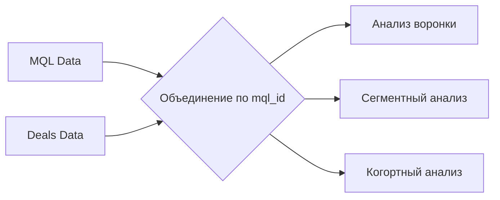

# analytics-projects
Портфолио проектов по анализу данных | Data Analytics Portfolio | Python, SQL, Visualization

# Data Analytics Portfolio | Портфолио аналитика данных

## Обзор портфолио
Коллекция аналитических проектов, демонстрирующих полный цикл работы с данными: от сбора и очистки до анализа, визуализации и бизнес-рекомендаций. Каждый проект решает конкретную бизнес-задачу с применением современных инструментов анализа.
*   [ Проект 1: Анализ Яндекс Такси | Key Metrics Dashboard. ](../project-1-yandex-taxi/README.md) Комплексный анализ данных Яндекс Такси Санкт-Петербург с фокусом на ключевые бизнес-метрики: динамика спроса, ценообразование, географическое распределение и выявление аномалий для оптимизации сервиса.  
*   [ Проект 2: A/B тестирование маркетинговой кампании| Conversion Optimization](../project-2-AB-test/README.md) Оценка эффективности рекламной кампании и определение, стоит ли масштабировать бюджет.
*   [ Проект 3: Анализ воронки продаж Olist](../project-3-olist-sales-funnel-analysys/README.md) Анализ маркетинговой воронки интернет-магазина Olist. Исследование пути клиента от первого контакта до закрытия сделки.
*   [Проект 4: Финансовый дашборд Wildberries FBS | Power BI](../project-4-wildberries-finance-dashboard/README.md)  Анализ продаж, рентабельности и топов товаров для ИП..., занимающегося продажами на WB
---

## 📁 Проект 1: Анализ Яндекс Такси | Key Metrics Dashboard

### 🚕 Описание проекта
Комплексный анализ данных Яндекс Такси Санкт-Петербург с фокусом на ключевые бизнес-метрики: динамика спроса, ценообразование, географическое распределение и выявление аномалий для оптимизации сервиса.  

### 🎯 Бизнес-задачи
1. **Анализ ценообразования** — выявление факторов, влияющих на стоимость поездок
2. **Оптимизация распределения** — анализ спроса по времени и географии
3. **Выявление аномалий** — обнаружение и исследование выбросов в данных
4. **Формулирование рекомендаций** — предложения по повышению эффективности сервиса


### Технологический стек и процесс

#### **1. Сбор данных:**
- **Источник**: Kaggle ([Yandex Taxi Saint-Petersburg dataset](https://www.kaggle.com/datasets/mlfool/yandex-taxi-saint-petersburg))
- **Объем**: 7,984 записей
- **Период**: Ноябрь 2024 года
- **Структура**: timestamp, цена, погода, координаты, спрос (0-1)

#### **2. Очистка и обработка:**

**Google Colab** - основной инструмент очистки
**Удалены:** пропуски, дубликаты, некорректные координаты
**Добавлены:** временные признаки, категории спроса

## **3. Анализ и визуализация**

### **Yandex DataLens**
Создание интерактивных дашбордов для анализа данных

##  **Структура проекта**

### 1. Анализ средней стоимости поездки

**Основные вопросы:**

* Как время суток влияет на стоимость поездок?

* Каково влияние погодных условий на ценообразование?

* В какой день недели выше средняя стоимость поездки?

**Методы анализа:**

* Статистический анализ распределений

* Сравнение средних значений по группам

### 2. Анализ продолжительности и географического распределения

**Основные вопросы:**

* Каковы наиболее популярные маршруты в городе?

* Как распределяется длительность поездок?

* Где расположены наиболее загруженные районы?

**Методы анализа:**

* Географическая визуализация

* Сравнение количества поездок в зависимости от продолжительности маршрута

### 3. Выявление аномалий и выбросов

**Основные вопросы:**

* Какие поездки являются статистическими выбросами?

* Как погодные аномалии влияют на стоимость?

* Какие данные требуют дополнительной проверки?

**Методы анализа:**

* Визуальная инспекция распределений

### **Три дашборда:**
1. **Анализ средней стоимости одной поездки** — динамика по времени и погоде https://datalens.yandex/vo635oazp08ef
   

2. **Анализ продолжительности и географического распределения поездок** — карта популярных маршрутов https://datalens.yandex/jc0uhz9puyou3
   

3. **Выявление аномалий** — статистические выбросы и паттерны https://datalens.ru/b4tgkcd0g0i2v
   

###  **Результаты**

* **Погода:** снег — средняя стоимость поездки высокая , облачно — низкая.В снег можно повысить цены за счёт повышенного спроса на такси из-за неудобств погоды (если спрос растёт).

* **День недели:** суббота — пик средней цены за поездку, среда — минимум. В воскресенье при  высокой стоимости средней поездки, количество поездок самое маленькое.В воскресенье можно вводить акции для привлечения клиентов (скидки на короткие поездки).

* **Время суток:** вечер — дорого, день — дёшево. В дневное время можно стимулировать спрос через скидки на поездки в торговые центры или бизнес-встречи.

* **Географическое распределение поездок:**

**Основные районы спроса:** большая часть поездок начинается или заканчивается в центральной части города, часто встречаются маршруты между центром и отдалёнными районами ).

**Направления движения:** много поездок из центра на юг/юго-восток (например, в район Купчино, Ржевка), также есть поездки между двумя точками в центре, но короткие (менее 2 км)

**Длина поездок:**

*Короткие поездки (0–3 км):* составляют значительную часть данных (например, поездки внутри центра), часто связаны с плохой погодой (снег, дождь) или ночным временем.

Предложение: ввести тариф для коротких поездок.

*Средние поездки (5–15 км):* Наиболее распространённая категория. Часто связывают центр с спальными районами.

Предложение: оптимизировать подачу машин в часы пик на таких направлениях.

*Длинные поездки (20–30 км):* встречаются реже, часто связаны с поездками в/из аэропорта или между удалёнными районами.

Предложение: ввести фиксированные тарифы для длинных маршрутов, чтобы снизить неопределённость для пассажиров.

## 🔍 Анализ выбросов и аномалий

### 1. Аномалии по стоимости
- **Максимальная стоимость**: 1 603,83 ₽.  
  Это явный выброс, особенно в сравнении с минимальной стоимостью (320 ₽) — разница **более чем в 5 раз**.

- **Топ‑7 самых дорогих поездок** (все > 1 500 ₽) имеют общие признаки:
  - **Время суток**: вечер или ночь (18:31–04:01).
  - **Погодные условия**: снег или дождь.
  - **Длина поездки**: 26–32 км.

**Вывод**: высокая стоимость обусловлена:
- ночным/вечерним временем (повышенный тариф);
- погодными условиями (доплаты за снег/дождь).

### 2. Аномалии по длине поездки
- **Максимальная длина**: 32,02 км.
- **Минимальная длина**: 0,50 км.

**Анализ**:
- Диапазон значителен, но топовые дорогие поездки (26–32 км) не выглядят аномально длинными для города.
- Поездка в **0,5 км** — очень короткая. Возможные причины:
  - поездки в пределах одного района;
  - технические/отладочные заказы.

### 3. Временные закономерности
Все дорогие поездки приходятся на **ноябрь 2024 года**, с явной концентрацией:
- **05.11.2024**: два рекордных заказа подряд (23:33 и 23:34) — оба в снегопад.
- **11–12, 19, 25 ноября**: вечерние/ночные поездки в снег или дождь.


**Выводы**:
- **Сезонный фактор**: первые снегопады ноября могли спровоцировать рост стоимости.
- **Пиковое время**: вечерние поездки с работы (18:00–24:00) совпадают с периодом повышенных тарифов.

## 📊 **Основные выводы**

### **Для бизнеса:**
1. **Погодный коэффициент**: В снег/дождь можно повышать цены на 20-30%
2. **Временная оптимизация**:
   - **Пиковые часы (17:00-22:00)**: увеличивать количество машин
   - **Низкий спрос (12:00-16:00)**: вводить дневные скидки 7-10%
3. **География**: Концентрация ресурсов в центральных районах

### **Для пользователей:**
1. **Экономия**: Поездки в дневное время на 15-20% дешевле
2. **Планирование**: Избегать поездок в пиковые часы и плохую погоду

## 💡 **Бизнес-рекомендации**

### **Операционные:**
1. **Динамическое ценообразование** на основе:
   - **Погодных условий** (коэффициент +20% в снег/дождь)
   - **Времени суток** (вечерний +15%, дневной -7%)
   - **Дня недели** (суббота +10%, среда -5%)

2. **Оптимизация автопарка**:
   - **Увеличение машин** в центре города
   - **Перераспределение** по часам пик
   - **Внедрение совместного такси** на популярные длинные маршруты

### **Маркетинговые:**
1. **Акция "Солнечный день"** — скидка 3-5% в ясную погоду
2. **Воскресный кэшбэк** — возврат 10% на следующую поездку при заказе в воскресенье.
3. **Дневной тариф** — фиксированная скидка 7% с 12:00 до 16:00
4. **Аэропорт** - фиксированных тариф (в зависимости от зоны обслуживания)

## 📁 **Структура проекта**


**Описание структуры(project-1-yandex-taxi):**

### 📁 **data/** — **Данные проекта**
- **raw/** — **Сырые данные** с Kaggle
  - Исходный CSV файл, данные без какой-либо обработки
- **processed/** — **Очищенные данные** (после Colab)
  - Данные после предобработки
  - Готовые для анализа файлы

### 📁 **notebooks/** — **Jupyter ноутбуки с анализом**
- **Yandex_taxi(1.ipynb** — Загрузка и первоначальный осмотр данных, очистка и предобработка данных

### 📁 **dashboards/** — **DataLens дашборды**
 - **"Screenshot 2026-02-10 at 14-13-39 Анализ продолжительности и географического распределения поездок - Yandex DataLen"**
 - **"Screenshot 2026-02-10 at 14-17-38 Анализ средней стоимости одной поездки - Yandex DataLens"**
 - **"Screenshot 2026-02-10 at 14-19-25 Выявление аномалий и выбросов - Yandex DataLens"**

### 📄 **README.md** — **Детальное описание проекта**
- Цели и задачи проекта
- Методология анализа
- Ключевые выводы


## 📁 Проект 2: A/B тестирование маркетинговой кампании| Conversion Optimization

---

## 📌 О проекте

**Цель исследования:** Оценить эффективность рекламной кампании и определить, стоит ли масштабировать бюджет.

**Источник данных:** [Kaggle: Marketing A/B Testing Dataset](https://www.kaggle.com/datasets/faviovaz/marketing-ab-testing)

---

## ТЕХНИЧЕСКИЙ СТЕК

| Инструмент | Назначение |
|-----------|-----------|
| **Python 3.10** | Основной язык программирования |
| **Pandas, NumPy** | Обработка и анализ данных |
| **Matplotlib, Seaborn** | Визуализация данных |
| **SciPy (stats)** | Статистические тесты (Shapiro, Mann-Whitney) |
| **Statsmodels** | Z-тест, доверительные интервалы, power analysis |
| **Google Colab** | Среда разработки |

**Ключевые вопросы:**
1. Приводит ли показ рекламы к статистически значимому росту конверсии?
2. Какой экономический эффект дает рекламная кампания?
3. Как оптимизировать частоту показов для повышения ROI?

---

##  Описание данных

| Поле | Описание |
|------|----------|
| `user id` | Уникальный ID пользователя |
| `test group` | Группа: `ad` (реклама) или `psa` (социальная реклама) |
| `converted` | Совершил покупку (True/False) |
| `total ads` | Количество просмотренных объявлений |
| `most ads day` | День с максимальным количеством просмотров |
| `most ads hour` | Час с максимальным количеством просмотров |

**Размер данных:** 588 101 запись   

---

##  Методология

### Проверка гипотез

**Гипотеза 1 (основная):**
- **H₀:** Конверсия в группе Ad = конверсии в группе PSA  
- **H₁:** Конверсия в группе Ad > конверсии в группе PSA  
- **Тест:** Z-тест для пропорций

**Гипотеза 2 (поведенческая):**
- **H₀:** Распределение просмотров у купивших = распределению у не купивших  
- **H₁:** Купившие видят значимо больше рекламы  
- **Тест:** Mann-Whitney U test (непараметрический)

**Почему Mann-Whitney, а не t-тест?**
- Распределение просмотров НЕ нормальное
- Гистограмма показывает сильную правостороннюю асимметрию
- Есть выбросы (пользователи с 1000+ просмотров)
- t-тест чувствителен к выбросам и может дать смещённую оценку
- Mann-Whitney сравнивает не средние, а распределения в целом
-  Нас интересует не столько разница средних, сколько факт:
  "Купившие стабильно видят больше рекламы, чем не купившие"

**Вывод:** Mann-Whitney — корректный выбор для данных с асимметричным распределением и выбросами.


  
## Статистическая проверка:
### Shapiro-Wilk test
p-value (купившие): 0.0000
p-value (не купившие): 0.0000
 Распределения НЕ нормальные → используем Mann-Whitney

## 📈 РЕЗУЛЬТАТЫ A/B ТЕСТА

### Конверсия по группам

| Группа | Пользователей | Покупок | Конверсия | 95% ДИ |
|--------|--------------|--------|-----------|--------|
| **Ad** | 564 577 | 14 423 | **2.555%** | [2.513%, 2.596%] |
| **PSA** | 23 524 | 420 | **1.785%** | [1.616%, 1.955%] |

 

**Относительный рост (Uplift):** +43.1%  
**Абсолютный рост:** +0.77 п.п.  
**Z-statistic:** 7.370 (p < 0.00001)  
**Результат:** СТАТИСТИЧЕСКИ ЗНАЧИМО  

**Мощность теста**: 1.000    
**Целевой уровень:** > 0.80  
**Риск ошибки II рода:** β ≈ 0%  

**Вывод по мощности:**  
Текущая выборка **ИЗБЫТОЧНА**. Для обнаружения эффекта +43% достаточно **~25 000 пользователей в группе**.

**Потенциальная экономия бюджета: 91%**

### Bootstrap-верификация
Bootstrap (10 000 итераций):
- Медианный Uplift: 43.25%
- 95% ДИ: [30.34%, 58.14%]
- Совпадение с Z-test:  ДА
- Вероятность положительного эффекта: >99.99%
---
## 📊 АНАЛИЗ ПОВЕДЕНИЯ: КУПИВШИЕ VS НЕ КУПИВШИЕ

### Ключевые метрики

  
| Метрика | Купившие 🟢 | Не купившие 🔴 | Разница |
|--------|------------|----------------|---------|
| **Количество** | 14 423 | 550 154 | — |
| **Медиана просмотров** | **64** | **13** | ▲ +51 |
| **Среднее просмотров** | **83.9** | **23.3** | ▲ +60.6 |
| **Стд. отклонение** | 87.5 | 40.9 | ▲ +114% |
| **25-й перцентиль** | 35 | 4 | ▲ +31 |
| **75-й перцентиль** | 103 | 26 | ▲ +77 |

**Mann-Whitney U:** 6 788 295 318  
**P-value:** 0.0000  
**Cohen's d:** 1.420 → 🔴 ОЧЕНЬ БОЛЬШОЙ ЭФФЕКТ  
**Различия статистически значимы**

---

### Ключевые инсайты:

**75% купивших** видели **>35 объявлений**  
**25% купивших** видели **>103 объявлений**  
**25% некупивших** отсеиваются практически сразу **(<4 просмотров)**. Остальные 75% взаимодействуют, но не конвертируются — здесь потенциал для ретаргетинга

---

## Конверсия по времени


### По дням недели

| День недели | Конверсия (Ad) | Пик |
|------------|----------------|-----|
| **Понедельник** | **3.31%** | 🥇 |
| **Вторник** | **3.09%** | 🥈 |
| **Среда** | **2.70%** | 🥉 |

### По часам

| Час | Конверсия (Ad) | Пик |
|-----|----------------|-----|
| **16:00** | **3.22%** | 🥇 |
| **20:00** | **3.02%** | 🥈 |
| **15:00** | **2.88%** | 🥉 |

**Лучшая комбинация:** **Понедельник, 16:00 — 3.24%**

---

##  ЭКОНОМИЧЕСКАЯ ЭФФЕКТИВНОСТЬ

### Исходные допущения

| Параметр | Значение |
|---------|----------|
| **Средний чек (AOV)** | 3 500 руб. |
| **Маржинальность** | 25% |
| **Прибыль с 1 покупки** | **875 руб.** |
| **CPM** (стоимость 1 000 показов) | 300 руб. |

---

### Текущая кампания

>  Фактически: **83,9 показа в среднем** 
>  **CPA = 370 руб**  
>  **ROI = 136%** 
>  **Прибыль на 1 000 показов = 4,8 руб**


---

### Сегментный анализ

| Сегмент (просмотров) | Конверсия | Рост к базе |
|---------------------|-----------|-------------|
| **0–10** | ~0.10% | — |
| **11–34** | ~1.20% | ▲ +1100% |
| **35–64** | **2.55%** | ▲ +2450% |
| **65–100** | **3.10%** | ▲ +3000% |
| **100+** | **3.40%** | ▲ +3300% |

 **Вывод:** Порог эффективности — **35+ просмотров**.  
Пользователи, достигшие этого порога, конвертируются в **25 раз чаще**.

---

## СТРАТЕГИЧЕСКИЕ РЕКОМЕНДАЦИИ

### 1. Двухэтапный ретаргетинг

---

**ЭТАП 1: ХОЛОДНАЯ АУДИТОРИЯ (0–13 просмотров)**  
**Кто это:** пользователи, которые только начали видеть рекламу  
**Цель:** заинтересовать и довести до 35+ просмотров  
**Тактика:** 3–5 показов в день, имиджевые креативы (узнаваемость)  
**KPI:** >30% переходят на следующий этап

---

**ЭТАП 2: ТЕПЛАЯ АУДИТОРИЯ (14–34 просмотра)**  
**Кто это:** пользователи, которые уже проявили интерес  
**Цель:** усилить вовлеченность и довести до 35+ просмотров  
**Тактика:** 6–10 показов в день, рациональная аргументация (польза, кейсы)  
**KPI:** >50% достигают порога 35 просмотров

---

**ЭТАП 3: ГОРЯЧАЯ АУДИТОРИЯ (35+ просмотров)**  
**Кто это:** максимально вовлеченные пользователи  
**Цель:** КОНВЕРСИЯ (покупка)  
**Тактика:** 15+ показов в день + промо-предложение (скидка, доставка, подарок)  
**KPI:** CR > 5%, CPA, ROI

---

** Суть стратегии:**  
Не ждать, пока пользователь сам накопит 35 просмотров —  
**помочь ему дойти до этого порога быстрее** и **конвертировать с выгодой**.

---


## 2. Оптимизация частоты показов (Frequency Cap)

---

###  Текущая ситуация

| Показатель | Значение |
|-----------|----------|
| **Медиана купивших** | 64 просмотра |
| **75% купивших** | 103+ просмотра |
| **Время накопления** | 2–3 недели |

**Проблема:**  
- Чтобы купить, пользователь должен увидеть рекламу **64 раза**  
- Это занимает **2–3 недели** — слишком долго  
- За это время **70% пользователей теряются**

---

###  Что делать

#### 1. Увеличить дневной лимит показов

| Было | Стало | Эффект |
|------|-------|--------|
| 3–5 показов/день | **15–20 показов/день** |  **рост в 4 раза** |

---

#### 2. Сократить время до покупки

| Было | Стало | Экономия |
|------|-------|----------|
| 14–21 день | **3–5 дней** |  **ускорение в 4 раза** |

---

#### 3. Запустить A/B тест

| Группа | Частота показов | Тип |
|--------|-----------------|-----|
| **A** (контроль) | 5 показов/день | Текущая стратегия |
| **B** (тест) | 10 показов/день | Цель: +30% CR |
| **C** (тест) | 15 показов/день | Цель: +50% CR |  

- **Длительность:** 14 дней    
- **Что измеряем:** Конверсию (CR), стоимость привлечения (CPA), время до покупки
---

## 3. Креативная последовательность

| 1–10 
 | --- | 
 | Имиджевый формат, узнаваемость | 
 | • Логотип, слоган, бренд-персонаж | 
 | • Без жестких офферов | 

| 11–34 
 | --- | 
 | Рациональная аргументация, кейсы | 
 | • Сравнение с конкурентами | 
 | • Отзывы клиентов, рейтинги | 
 | • Решение проблем целевой аудитории | 

 | 35+ показов: "Промо-предложение" | 
 | --- | 
 | Стимулирующее предложение | 
 | • Скидка 15–20% | 
 | • Бесплатная доставка | 
 | • Подарок при покупке | 
 | • Ограничение по времени (срочность) |

---
## 📈 ПРОГНОЗ ЭФФЕКТИВНОСТИ ЧЕРЕЗ 3 МЕСЯЦА 
*(на основе данных A/B теста и бизнес-допущений)*

---

### 1. ТЕКУЩИЕ ПОКАЗАТЕЛИ (ФАКТ)

| Метрика                  | Группа ad (реклама) | Группа psa (контроль) |
|--------------------------|----------------------|------------------------|
| **Конверсия (CR)**       | 2.55%               | 1.79%                 |
| **Показов (total ads)**  | 17 773 852         | 871 278               |
| **Конверсий**            | 14 423             | 420                   |
| **Медиана просмотров**   | 64                  | —                     |
| **Среднее просмотров**   | 83.9                | —                     |
| **Затраты (CPM = 300 ₽)** | **5 332 156 руб.** | —                     |
| **CPA (факт)**           | **370 руб.**        | —                     |

### 🔍 Ключевой вывод  
- **Реклама работает**: конверсия в группе `ad` **на 43% выше**, чем в группе `psa` (2.55% vs 1.79%).  
- **Кампания прибыльна**: фактический CPA = **370 руб.**, ROI **+136%** (при допущениях: AOV = 3 500 ₽, маржинальность = 25%).  


---

### 2. БИЗНЕС-ДОПУЩЕНИЯ (ДЛЯ ПРОГНОЗА)

| Параметр               | Значение     | Статус                                  |
|------------------------|--------------|------------------------------------------|
| **CPM**                | 300 руб.     | ⚠️ Допущение (стандарт рынка)           |
| **Средний чек**        | 3 500 руб.   | ⚠️ Допущение (не из данных)            |
| **Маржинальность**     | 25%          | ⚠️ Допущение (не из данных)            |
| **Прибыль с 1 покупки**| 875 руб.     | ⚠️ Расчёт на основе допущений          |

---

### 3. ПРОГНОЗ ЧЕРЕЗ 3 МЕСЯЦА (ПРИ ВНЕДРЕНИИ РЕКОМЕНДАЦИЙ)

| Метрика                               | Текущее значение     | Прогноз              | Изменение        |
|---------------------------------------|----------------------|----------------------|------------------|
| **Конверсия (CR)**                   | 2.55%               | 3.8 – 4.2%          | ▲ **+50–65%**   |
| **Время до конверсии**               | 14–21 дн.\*         | 5–7 дней            | ▼ **-70%**      |
| **CPA** (CPM = 300 ₽)               | **370 руб.**        | **260–285 руб.**    | ▼ **-23–30%**   |
| **Доп. прибыль** (на 1 млн юзеров)  | —                   | **~4,2 млн ₽**      | —               |
| **ROI****                           | **+136%**           | **>250%**           | ▲ **+114 п.п.** |

> \* Оценка на основе бизнес-экспертизы, в данных отсутствует.  
> \** CPA прогнозируется исходя из снижения на 30% при росте CR и оптимизации частоты.  
> \*** Доп. прибыль рассчитана как (прирост конверсий × прибыль с 1 покупки) при CPM = 300 ₽.  
> \**** ROI рассчитан при допущениях: CPM = 300 ₽, средний чек = 3 500 ₽, маржинальность = 25%.

---

### 4. ЭКОНОМИЧЕСКАЯ ЭФФЕКТИВНОСТЬ (ФАКТ VS ПРОГНОЗ)

| Показатель                    | Текущая кампания | Прогноз через 3 мес. | Изменение       |
|-------------------------------|------------------|----------------------|-----------------|
| **CPA**                       | 370 руб.         | 260–285 руб.         | ▼ -23–30%       |
| **ROI**                       | +136%            | >250%                | ▲ +114 п.п.     |
| **Прибыль на 1 000 показов** | 4,8 руб.         | 7,2 руб.             | ▲ +50%          |
| **Окупаемость инвестиций**    | 2,4 покупки      | 3,6 покупки          | ▲ +50%          |

**Ключевой экономический вывод:**        
- Текущая кампания **прибыльна** (ROI = +136%).    
- Оптимизация частоты и ретаргетинг **удвоят ROI** (до >250%).      
- Целевой CPA = **260–285 руб.** — реалистичный ориентир для масштабирования.  
---

### Требует уточнения:
- **CPA** — необходима реальная стоимость закупки трафика.
- **Время до конверсии** — требуется внедрение сквозной аналитики.
- **Доп. прибыль и ROI** — зависят от принятых допущений.

---

## ОГРАНИЧЕНИЯ ИССЛЕДОВАНИЯ

1. **Нет данных о времени проведения** — возможна сезонность
2. **Нет данных о креативах** — неизвестно, какие именно объявления показывались
3. **PSA группа мала** (23524 vs 564577) — возможно смещение оценок
4. **CPA рассчитан на CPM = 300 руб.** — реальная стоимость может отличаться
5. **Нет данных о LTV** — оценка только по первой покупке
6. **Нет данных о частоте показов** — frequency cap оценивался косвенно
   
---

**Описание структуры(marketing-ab-test/):**

### 📁 **data1/** — **Данные проекта**
- **raw1/** — **Сырые данные** с Kaggle
  - Исходный CSV файл, данные без какой-либо обработки

### 📁 **notebooks1/** — **Jupyter ноутбуки с анализом**
- **A_B_testing.ipynb** -  Основной ноутбук с полным анализом

### 📁 **visuals/** — **Графики**
 - **Ящик с усам.png** (купившие vs не купившие)
 - **Размер групп, конверсия по группам, количество покупок.png** (Конверсия по группам Ad/PSA)
 - **Распределение просмотров рекламы, конверсия по дням недели, конверсия по часам, зависимость конверсии от просмотров.png** (Анализ конверсии по дням/часам)
 - **Проверка нормальности распределения.png** (Обоснование выбора Mann-Whitney)

### 📄 **README1.md** — **Детальное описание проекта**

---

# 🔻 Комплексный анализ воронки продаж Olist

##  Описание проекта
Данный проект посвящен анализу маркетинговой воронки бразильского маркетплейса **Olist**. Я исследовала путь продавца от момента, когда он впервые оставляет заявку (MQL), до момента заключения сделки и становления продавцом на платформе.

**Почему это важно?**
Понимание воронки продаж позволяет бизнесу:
- Оптимизировать маркетинговый бюджет
- Увеличить конверсию на каждом этапе
- Выявить наиболее перспективные ниши
- Улучшить пользовательский опыт


## Цели исследования
1. **Оценить эффективность** текущей воронки продаж
2. **Выявить лучшие каналы** привлечения клиентов
3. **Определить топ-сегменты** бизнеса по количеству сделок
4. **Проанализировать конверсию** по различным источникам трафика
5. **Сформулировать рекомендации** для роста бизнеса

## Данные
- **Источник данных:** [Kaggle: Marketing Funnel by Olist](https://www.kaggle.com/datasets/olistbr/marketing-funnel-olist/data)
- **Период:** Июнь 2017 - Июнь 2018
- **Маркетинговые лиды (MQL):** 8,000
- **Закрытые сделки:** 842
- **Бизнес-сегментов:** более 50 категорий
  
### Структура данных

```python
# Marketing Qualified Leads (MQL)
mql_columns = {
    'mql_id': 'Уникальный ID лида',
    'first_contact_date': 'Дата первого контакта',
    'landing_page_id': 'ID лендинга',
    'origin': 'Источник трафика'
}

# Closed Deals
deals_columns = {
    'mql_id': 'ID лида (связь с MQL)',
    'seller_id': 'ID продавца',
    'sdr_id': 'ID менеджера по развитию продаж (SDR)',
    'sr_id': 'ID менеджера по продажам (SR)',
    'won_date': 'Дата закрытия сделки',
    'business_segment': 'Бизнес-сегмент',
    'lead_type': 'Тип лида',
    'lead_behaviour_profile': 'Поведенческий профиль',
    'business_type': 'Тип бизнеса',
    'declared_monthly_revenue': 'Заявленный месячный доход'
}
```

  ## ТЕХНИЧЕСКИЙ СТЕК

| Инструмент | Назначение |
|-----------|-----------|
| **Python 3.10** | Основной язык программирования |
| **Pandas, NumPy** | Обработка и анализ данных |
| **Matplotlib, Seaborn, Plotly** | Визуализация данных |
| **Google Colab** | Среда разработки |

### Схема данных


```mermaid
graph LR
    A[MQL Data] --> C{Объединение по mql_id}
    B[Deals Data] --> C
    C --> D[Анализ воронки]
    C --> E[Сегментный анализ]
    C --> F[Когортный анализ]
```

##  Ход исследования

### 1. Загрузка и первичный анализ

```python
import pandas as pd
import numpy as np
import plotly.express as px
import plotly.graph_objects as go

# Загрузка данных
mql_df = pd.read_csv('data/raw/olist_marketing_qualified_leads_dataset.csv')
deals_df = pd.read_csv('data/raw/olist_closed_deals_dataset.csv')

print(f"MQL: {mql_df.shape}")
print(f"Deals: {deals_df.shape}")
```

**Результат:**
- MQL датасет: 8,000 записей, 4 колонки
- Deals датасет: 842 записи, 14 колонок
- Период данных: июнь 2017 — июнь 2018

  ### 2. Очистка данных

**Основные шаги очистки:**
1. Заполнение пропусков в 'origin' → 'unknown'
2. Преобразование дат в datetime
3. Заполнение категориальных признаков ('business_segment', 'lead_type') → 'unknown'
4. Объединение датафреймов по 'mql_id'
5. Создание признака 'is_converted'

##  Ключевые метрики

### Общая воронка

| Показатель | Значение | Процент |
|----------|----------|---------|
| Маркетинговые лиды (MQL) | 8 000 | 100 % |
| Закрытые сделки | 842 | 10,53 % |
| Потеряно лидов | 7 158 | 89,47 % |

### Конверсия по источникам трафика

| Источник | Лиды | Сделки | Конверсия | Эффективность* |
|--------|------|-------|----------|---------------|
| unknown | 1 159 | 193 | 16,65 % | 1,44 |
| paid_search | 1 586 | 195 | 12,30 % | 2,02 |
| organic_search | 2 296 | 271 | 11,80 % | 0,41 |
| direct_traffic | 499 | 56 | 11,22 % | 7,01 |
| referral | 284 | 24 | 8,45 % | 9,39 |
| social | 1 350 | 75 | 5,56 % | 1,46 |
| display | 118 | 6 | 5,08 % | 7,26 |
| other_publicities | 65 | 3 | 4,62 % | 7,70 |
| email | 493 | 15 | 3,04 % | 3,04 |
| other | 150 | 4 | 2,67 % | 3,34 |

> *Эффективность = конверсия / доля трафика (чем выше, тем лучше)

---

##  Визуализации

### 1. Воронка продаж
<div align="center">
  
  <p><em>Рисунок 1. Воронка продаж Olist</em></p>
</div>

**Наблюдение:** только каждый 10‑й лид становится продавцом. Основные потери происходят на этапе между первым контактом и закрытием сделки.

### 2. Распределение лидов по источникам

<div align="center">
  
  <p><em>Рисунок 2. Распределение маркетинговых лидов по источникам трафика</em></p>
</div>

**Ключевые каналы:**
* 1 `organic_search` — 28,7 % (2 296 лидов);
* 2 `paid_search` — 19,8 % (1 586 лидов);
* 3 `social` — 16,9 % (1 350 лидов).

### 3. Конверсия по источникам

<div align="center">
  
  <p><em>Рисунок 3. Конверсия MQL → Closed Deal по источникам трафика</em></p>
</div>

**Топ‑3 по конверсии:**
* `unknown` — 16,65 % (требует уточнения);
* `paid_search` — 12,30 % (самый эффективный);
* `organic_search` — 11,80 % (стабильный результат).

### 4. Топ‑10 бизнес‑сегментов

<div align="center">
  
  <p><em>Рисунок 4. Топ-10 бизнес-сегментов по количеству закрытых сделок</em></p>
</div>

| Место | Сегмент | Сделок | Доля |
|------|--------|-------|------|
| 1 | home_decor | 105 | 17,6 % |
| 2 | health_beauty | 93 | 15,6 % |
| 3 | car_accessories | 77 | 12,9 % |
| 4 | household_utilities | 71 | 11,9 % |
| 5 | construction_tools_house_garden | 69 | 11,6 % |
| 6 | audio_video_electronics | 64 | 10,7 % |
| 7 | computers | 34 | 5,7 % |
| 8 | pet | 30 | 5,0 % |
| 9 | food_supplement | 28 | 4,7 % |
| 10 | food_drink | 26 | 4,4 % |

### Когортный анализ
Когортный анализ позволяет отследить, как меняется конверсия лидов в зависимости от месяца их первого контакта с платформой. Cгруппируем лидов по месяцу первого обращения и посмотрим, сколько из них становятся продавцами и как быстро.

### Динамика конверсии по месяцам

<div align="center">
  
  <p><em>Рисунок 5. Динамика конверсии по месяцам первого контакта</em></p>
</div>

### Когортная таблица

| Когорта | Лиды | Месяц 0 | Месяц 1 | Месяц 2 | Месяц 3+ | Всего сделок | Конверсия % |
|---------|------|---------|---------|---------|----------|--------------|-------------|
| 2017-06 | 4 | 0 | 0 | 0 | 0 | 0 | 0.00% |
| 2017-07 | 239 | 0 | 0 | 0 | 2 | 2 | 0.84% |
| 2017-08 | 386 | 0 | 0 | 0 | 9 | 9 | 2.33% |
| 2017-09 | 312 | 0 | 0 | 0 | 7 | 7 | 2.24% |
| 2017-10 | 416 | 0 | 0 | 0 | 14 | 14 | 3.37% |
| 2017-11 | 445 | 0 | 2 | 4 | 12 | 18 | 4.04% |
| 2017-12 | 200 | 1 | 3 | 2 | 5 | 11 | 5.50% |
| **2018-01** | **1,141** | **64** | **43** | **16** | **29** | **152** | **13.32%** |
| **2018-02** | **1,028** | **65** | **48** | **11** | **25** | **149** | **14.49%** |
| **2018-03** | **1,174** | **82** | **47** | **11** | **27** | **167** | **14.22%** |
| **2018-04** | **1,352** | **129** | **25** | **13** | **16** | **183** | **13.54%** |
| 2018-05 | 1,303 | 70 | 28 | 7 | 25 | 130 | 9.98% |

###  Тепловая карта когорт

<div align="center">
  
  <p><em>Рисунок 6. Тепловая карта: распределение сделок по месяцам после первого контакта</em></p>
</div>

*Тепловая карта показывает, сколько сделок закрылось в каждый месяц после первого контакта. Чем ярче цвет, тем больше сделок.*

---

## Выводы и анализ

### Основные инсайты


 **1: Правило Парето в действии**

```python
top_3_segments = ['home_decor', 'health_beauty', 'car_accessories']
top_3_deals = 105 + 93 + 77  # 275 сделок
total_deals = 597  # сделки в топ-10
share = (275 / 597) * 100  # 46.1%

print(f"Топ-3 сегмента дают {share:.1f}% всех сделок")
```
**Вывод:** Анализ подтвердил действие правила Парето: фокусировка на 30% ключевых сегментов (home_decor, health_beauty, car_accessories) обеспечивает 46.1% всех закрытых сделок. Это позволяет оптимизировать маркетинговый бюджет и усилия sales-команды."

**2: Парадокс платного трафика**

```text
organic_search: 28,7 % трафика → конверсия 11,8 %
paid_search: 19,8 % трафика → конверсия 12,3 %
```
**Вывод:** Платный трафик качественнее и требует увеличения бюджета

**3: Кризис email-маркетинга**

```python
email_conversion = 3.04  # %
avg_conversion = 10.53  # %
gap = avg_conversion - email_conversion  # 7.49%
print(f"Email-маркетинг отстает от среднего на {gap:.1f}%")
```
**Вывод:** Email-маркетинг отстает от средней конверсии на **7.5%**. Необходимо пересмотреть стратегию.

**4: Реферальный потенциал**
```text
Данные
- referral_traffic: 3.5% от общего объема
- referral_conversion: 8.45% (выше среднего уровня)
```
**Выводы**: Высокая эффективность рефералов указывает на значительный потенциал программы лояльности.

 **5: Абсолютный лидер**
```text
Данные
- home_decor: 105 сделок (17.6% от топ-10 категорий)
```
**Выводы**: Домашний декор является абсолютным лидером продаж и требует разработки специальной премиальной стратегии продвижения.

### Ключевые инсайты когортного анализа:

**6: Резкий рост качества лидов в 2018 году**
```text
- 2017 год: средняя конверсия 2.6%
- 2018 год: средняя конверсия 13.1%

Качество лидов выросло в 5 раз! 
```
**7: Скорость закрытия сделок**

```python
# Суммируем сделки 2018 года по месяцам после контакта
month_0 = 64 + 65 + 82 + 129 + 70 = 410
month_1 = 43 + 48 + 47 + 25 + 28 = 191
month_2 = 16 + 11 + 11 + 13 + 7 = 58
month_3plus = 29 + 25 + 27 + 16 + 25 = 122

quick_deals = month_0 + month_1  # 410 + 191 = 601
quick_share = (quick_deals / 781) * 100  # 76.9%

print(f"76.9% сделок закрываются в первые 2 месяца!")
```
**8: Пик и спад**
```text
Пик конверсии: февраль 2018 (14.49%)
Самый низкий результат: декабрь 2017 (5.50%)

Праздничный сезон негативно влияет на качество лидов
```
**9: Масштабирование без потери качества**
```text
Рост лидов: 2002 (2017) → 5998 (2018) = +200%
Рост сделок: 61 (2017) → 781 (2018) = +1180%
Рост конверсии: 2.6% → 13.1% = +404%
```
> **Когортный анализ показал впечатляющие результаты:**
>
> - Конверсия выросла с **2.6% в 2017** до **13.1% в 2018** (+404%)
> - **76.9% сделок** закрываются в первые 2 месяца после первого контакта
> - Пик конверсии пришелся на **февраль 2018 (14.49%)**
> - Декабрь показал самую низкую конверсию **(5.50%)**
>
> Тепловая карта наглядно демонстрирует, что большинство сделок концентрируется в первые месяцы после контакта, а когорты 2018 года значительно превосходят по качеству когорты 2017 года.
>
> Это подтверждает, что улучшение качества трафика и оптимизация воронки дали значительный результат. 

###  Рекомендации на основе анализа данных

#### 1. Каналы трафика

| Канал | Текущая ситуация | Рекомендация | Обоснование |
|-------|------------------|--------------|-------------|
| **paid_search** | 19.8% трафика, 12.3% конверсии | ✅ Увеличить бюджет | Самый качественный трафик |
| **organic_search** | 28.7% трафика, 11.8% конверсии | ✅ Усилить SEO | Основной источник лидов |
| **referral** | 3.5% трафика, 8.45% конверсии | ✅ Развивать программу лояльности | Высокий потенциал |
| **email** | 493 лидов, 3.04% конверсии | 🔄 Требует перезагрузки | Сильно ниже среднего |
| **social** | 16.9% трафика, 5.56% конверсии | 🔄 Оптимизировать | Низкая эффективность |

#### 2. Бизнес-сегменты

| Сегмент | Сделок | Доля | Рекомендация |
|---------|--------|------|--------------|
| **home_decor** | 105 | 17.6% |  Отдельная премиум-стратегия |
| **health_beauty** | 93 | 15.6% |  Программа лояльности |
| **car_accessories** | 77 | 12.9% |  Партнерства с автосервисами |
| **остальные сегменты** | 322 | 53.9% |  Требуют дополнительного анализа |

#### 3. Распределение сделок по времени закрытия

| Время до сделки | Количество сделок | Доля |
|-----------------|-------------------|------|
| **В тот же месяц** | 411 | 48.8% |
| **Через 1 месяц** | 191 | 22.7% |
| **Через 2 месяца** | 58 | 6.9% |
| **Через 3+ месяцев** | 182 | 21.6% |


---

###  Общие рекомендации по приоритетам

#### 🔴 Высокий приоритет (сделать в первую очередь)
* **Увеличить бюджет на `paid_search`**  
  Потому что у него самая высокая конверсия (12,3 %).
* **Сфокусироваться на топ‑3 сегментах**  
  Потому что они дают 46 % всех сделок (`home_decor`, `health_beauty`, `car_accessories`).
* **Упростить форму заявки на лендинге**  
  Чтобы уменьшить количество полей и барьеров, что позволит увеличить количество лидов.

---

#### 🟡 Средний приоритет (следующий этап)

* **Запустить реферальную программу**  
   Потому что `referral` показывает высокую эффективность (конверсия 8,45 % при доле трафика 3,5 %).
* **Переработать email‑стратегию**  
   Потому что текущая конверсия 3,04 % — это значительно ниже среднего уровня (10,53 %), отставание составляет 7,49 %.
* **Оптимизировать продвижение в социальных сетях (`social`)**  
   Потому что на этот канал приходится 16,9 % трафика, но только 5,56 % конверсии — есть потенциал для улучшения показателей.

---

#### 🟢 Низкий приоритет (на перспективу)

* **Исследовать сегмент `pet`** (5 % сделок)  
  Есть потенциал роста: сегмент пока не входит в топ‑3, но показывает стабильные результаты.
* **Проанализировать сегмент `food_drink`** (4,4 % сделок)  
  Возможно, нужна отдельная логистика или специальные условия для продавцов этой категории.

---

##  Простая матрица рекомендаций

| Что делать | Зачем | Ожидаемый результат |
|----------|------|------------------|
| Больше денег в `paid_search` | Он лучше конвертирует (12,3 % против 11,8 % у `organic_search`) | Увеличение количества сделок за счёт более качественного трафика |
| Фокус на топ‑3 сегмента | Они дают почти половину сделок (46 %) по правилу Парето | Более эффективное распределение ресурсов и рост ROI |
| Упростить форму заявки | Меньше барьеров на этапе подачи заявки | Рост количества лидов (прогнозируемо +5 % MQL→консультация) |
| Запустить реферальную программу | Люди доверяют рекомендациям знакомых больше, чем рекламе | Привлечение качественных лидов с высокой конверсией (8,45 %) |
| Переделать email‑маркетинг | Текущая конверсия критически низкая (3,04 %) | Удвоение конверсии канала до 6 % и выше |

---
**Описание структуры(project-3-olist-sales-funnel-analysys/):**

### 📁 **data2/** — **Данные проекта**
- **Сырые данные** с Kaggle
  - Исходные CSV файлы, данные без какой-либо обработки

### 📁 **notebooks2/** — **Jupyter ноутбуки с анализом**
- **Анализ_воронки_продаж_Olist.ipynb** -  Основной ноутбук с полным анализом

### 📁 **visuals2/** — **Графики**
 - **Воронка продаж.png** 
 - **Конверсия MQL.png**
 - **Распределение маркетинговых лидов по источникам трафика**
 - **Топ-10 бизнес-сегментов по количеству закрытых сделок (цветная)**
 - **Топ-10 бизнес-сегментов по количеству закрытых сделок**
 - **Динамика конверсии по месяцам первого контакта**
 - **Тепловая карта: сделки по месяцам после первого контакта**

### 📄 **README.md** — **Детальное описание проекта**

## Проект 4:  Финансовый дашборд Wildberries (FBS) | Power BI

**Анализ продаж, рентабельности и топов товаров для ИП ...**


---
### Источники данных

| Источник | Тип данных | Назначение |
|----------|-----------|------------|
| **Wildberries API** (PostgreSQL) | Продажи, заказы, логистика, остатки | Основная фактическая информация |
| **Google Sheets** | Себестоимость, справочник артикулов, тарифы | Справочные и расчётные данные |

## О проекте

**Заказчик:** ИП ... (продажа галантереи на Wildberries)  
**Метод поставки:** FBS (товар на складе WB)  
**Бизнес-задача:** Создать автоматизированный инструмент для оценки реальной рентабельности бизнеса

### Ключевые боли бизнеса

| Боль | Решение в дашборде |
|------|---------------------|
|  Не понимают реальные затраты (логистика, комиссия, налоги) | Расчёт валовой прибыли с учётом всех затрат |
|  Сложно оценить, какой товар перестают покупать | Топы лидеров роста и падения с динамическим периодом |
|  Нет понимания приоритетных складов | Географический анализ продаж по областям |

### Что сделано

- Дашборд в Power BI с подключением к Postgres (API WB) и Google Sheets (https://drive.google.com/file/d/1SE1mZR-XC1767Wr3jeBz6t9XjUK382oS/view?usp=sharing)
- Очистка данных
- Настройка связей модели
- Добавление новых таблиц ("Календарь", "Лидеры продаж")
- Расчёт валовой прибыли с учётом возвратов, логистики и комиссий
- Автоматические топы лидеров роста и падения
- Географический анализ продаж для складской оптимизации
- 13 DAX-мер для всех метрик из ТЗ
- Срезы по дате
---
## 🎮 Интерактивность и Навигация

Дашборд спроектирован как **полностью интерактивный инструмент**, позволяющий пользователю самостоятельно исследовать данные без необходимости запрашивать новые отчеты.

###  Гибкая фильтрация по времени
Главным элементом управления является **срез по датам**, расположенный в шапке отчета.
- **Выбор периода:** Пользователь может задать любой произвольный диапазон дат (например, `01.01.2022` — `30.09.2022`).
- **Динамический пересчет:** При изменении дат в срезе **все** визуализации на странице (карточки KPI, графики динамики, таблицы топов) мгновенно пересчитываются под выбранный период.
- **Сравнение периодов:** Позволяет оперативно оценить сезонность и тренды, переключаясь между месяцами, кварталами или неделями.

###  Глубокая кросс-фильтрация
Все визуальные элементы связаны между собой. Клик по любому объекту на дашборде фильтрует остальные данные:

1.  **Анализ по Регионам:**
    *   При нажатии на столбец конкретного региона (например, *«Москва»*) в графике **«Продажи по областям»**:
    *  График динамики ROI покажет рентабельность **только по Москве**.
    *   Таблица **«Лидеры роста»** отсортирует товары, которые лучше всего продавались именно в этом регионе.

2.  **Детализация по Артикулу (SKU):**
    *   При клике на конкретный товар (например, *`supplierArticle 96`*) в таблице **«Лидеры возвратов»**:
    *   Карточка **«Выручка WB»** покажет доход только по этому артикулу.
    *   График **«Динамика выручки»** отобразит продажи данного товара во времени.

3.  **Изоляция данных:**
    *   При наведении курсора на точку графика подсвечиваются соответствующие данные в таблицах, что позволяет быстро сопоставить визуальный тренд с точными цифрами.

### 💡 Сценарии использования
*   **Сценарий «Почему упала прибыль?»**
    - Пользователь выбирает проблемный месяц в срезе дат.
    - Смотрит таблицу «Лидеры падения» — находит товар с минусовой динамикой.
    - Кликает на этот товар в таблице — видит, что в конкретном регионе (например, *«Свердловская обл.»*) были аномальные возвраты.
*   **Сценарий «Оценка эффективности региона»**
    - Кликает на *«Санкт-Петербург»* в графике продаж.
    - Анализирует ROI по этому региону.
    - Принимает решение об увеличении стока на местном складе.

  ---     
## 📊 Результаты дашборда

### Модель данных


---
## 📊 Визуализации дашборда


### Блок 1: KPI карточки

| Метрика | Значение (2022) |
|---------|-----------------|
| Выручка WB | 56,66 млн ₽ |
| Заказов | 129 тыс. шт |
| Комиссия WB | 5 млн ₽ |
| Комиссия WB, % | 9,08% |
| Логистика | 16,91 млн ₽ |
| Валовая прибыль | 33,46 млн ₽ |
| Рентабельность | 59,04% |

> *Полный DAX-код всех 13 мер — в папке `measures/` репозитория.*
---
### Блок 2: Динамика

**Динамика выручки**
- Линейный график по дням (янв 2022 - сен 2022)
- Ось X: Период (дни)
- Ось Y: Выручка (млн ₽)
- Показывает сезонные колебания и тренды продаж

**Динамика ROI**
- Линейный график с показателем рентабельности инвестиций
- Ось X: Период (дни)
- Ось Y: ROI (%)
- Отображает эффективность инвестиций в товарные запасы

---

### Блок 3: Аналитика

**Продажи по областям**
- Горизонтальная гистограмма
- Топ регионов:
  - Москва
  - Московская область
  - Санкт-Петербург
- Показывает географическое распределение выручки

**Лидеры роста**
- Таблица с артикулами по приросту выручки относительно аналогичного прошлого периода
- Колонки:
  - Артикул
  - Выручка WB (текущий период)
  - Изменение выручки (абсолютное)
  - Изменение выручки (%)
- Сортировка: по убыванию прироста

**Лидеры падения**
- Таблица с артикулами, показавшими отрицательную динамику относительно аналогичного прошлого периода
- Колонки:
  - Артикул
  - Выручка WB (текущий период)
  - Изменение выручки (абсолютное)
  - Изменение выручки (%)
- Сортировка: по возрастанию (наибольшее падение сверху)

**Лидеры возвратов**
- Топ товаров по количеству возвратов
- Колонки:
  - Артикул
  - Количество возвратов (шт)
- Помогает выявить проблемные позиции

---

##  Бизнес-инсайты

###  Выявлено в ходе анализа:

1. **Высокая рентабельность** — 59% указывает на эффективную бизнес-модель
   - Валовая прибыль составляет более половины выручки
   - Бизнес генерирует стабильный денежный поток

2. **Географическая концентрация** — основная выручка приходится на Москву и МО
   - Центральный федеральный округ доминирует в продажах
   - Есть потенциал для расширения в другие регионы

3. **Неравномерная динамика** — наблюдаются сезонные пики и спады
   - Периоды высокой активности чередуются с низкими продажами
   - Требуется планирование запасов с учётом сезонности

4. **Товарная дифференциация** — некоторые артикулы показывают рост >1000%, другие падают
   - Поляризация ассортимента по эффективности
   - Необходима оптимизация товарной матрицы

---

## 💡 Рекомендации

### 1. Оптимизация логистики
**Пересмотреть приоритетные склады с учётом географии продаж**

**Действия:**
- Увеличить запасы на складах Москвы и МО (основной спрос)
- Проанализировать целесообразность складов в регионах с низким спросом
- Оптимизировать маршруты доставки для снижения логистических затрат

**Ожидаемый эффект:**
- Снижение затрат на логистику на 10-15%
- Ускорение доставки до клиентов

---

### 2. Ассортиментная политика
**Сфокусироваться на товарах-лидерах роста**

**Действия:**
- Увеличить закупки артикулов с ростом >500%
- Вывести из ассортимента товары с устойчивым падением
- Провести ABC-анализ ассортимента

**Ожидаемый эффект:**
- Рост оборачиваемости товаров
- Увеличение общей выручки на 15-20%

---

### 3. Работа с возвратами
**Проанализировать причины возвратов топ-артикулов**

**Действия:**
- Выявить топ-10 товаров по количеству возвратов
- Проанализировать причины (брак, несоответствие описанию, размер)
- Улучшить карточки товаров (фото, описание, размерная сетка)
- Ввести контроль качества перед отгрузкой

**Ожидаемый эффект:**
- Снижение процента возвратов на 20-30%
- Экономия на логистике возвратов
- Повышение рейтинга продавца на WB

---

### 4. Ценообразование
**Учесть реальную себестоимость с логистикой при установке цен**

**Действия:**
- Рассчитать полную себестоимость для каждого артикула:
  - Закупочная цена
  - Комиссия WB (12%)
  - Логистика (55-220 ₽/ед. в зависимости от категории)
  - Хранение (0.08 ₽/день)
  - Налог
- Установить минимальную цену с целевой рентабельностью 40-50%
- Внедрить динамическое ценообразование для товаров с низкой маржой

**Ожидаемый эффект:**
- Исключение убыточных продаж
- Стабилизация рентабельности на уровне 50-60%

---

## 📈 Приоритеты внедрения

### 🔴 Высокий приоритет (1-2 недели)
1. Анализ лидеров возвратов и исправление карточек товаров
2. Корректировка цен на товары с рентабельностью <30%

### 🟡 Средний приоритет (1 месяц)
3. Оптимизация распределения товаров по складам
4. Увеличение запасов лидеров роста

### 🟢 Низкий приоритет (3 месяца)
5. Расширение ассортимента в перспективных категориях
6. Тестирование новых регионов продаж

---

*Данные актуальны на период: январь 2022 - сентябрь 2022*  
*Обновление: ежемесячно*

---

## 📁 **Структура проекта**


**Описание структуры(project-4-wildberries-finance-dashboard):**

### 📁 **gratnic4/** — **Визуализация**
- **"модель данных"**
- **"дашборд анализ  продаж ВБ"**

### 📁 **measures/** — **Меры**
 - **"measures"**

### 📄 **README.md** — **Детальное описание проекта**

